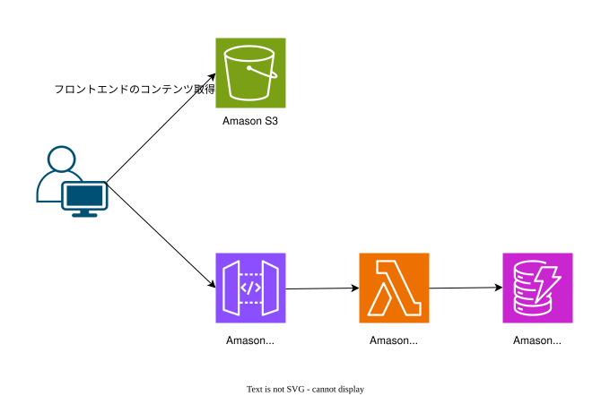

# sample-localstack-serverless-app
LocalStack 上に S3 website + API Gateway + Lambda + DynamoDB を立て、React (Vite) フロントを配信するサンプルです。


## 前提条件
- Docker / Docker Compose
- make
- Node.js
- Terraform

## 初期セットアップ
1. LocalStack を起動: `make up`
2. フロント依存インストール: `cd frontend && pnpm install`
3. Lambda 依存インストール: `cd lambda && npm install`
4. フロントをビルド（Terraform が `frontend/dist` を配信するため必須）: `cd frontend && pnpm build`
5. Terraform 初期化とデプロイ（LocalStack へ反映）:
   ```bash
   make init
   make plan
   make apply
   ```

## 実行・確認
- フロント開発サーバー: `cd frontend && VITE_API_BASE_URL=http://localhost:4566/restapis/<restapi-id>/dev/_user_request_/api pnpm dev`
  - `<restapi-id>` は `awslocal apigateway get-rest-apis` などで取得可。
- ビルド成果物経由の確認（S3 website）: http://testbucket.s3-website.localhost.localstack.cloud:4566/
- API 動作確認例: `curl "$VITE_API_BASE_URL/threads/all"` （200 が返れば OK）。

## 停止・後片付け
- LocalStack 停止: `make down`
- スタック削除（必要に応じて）: `make destroy`
